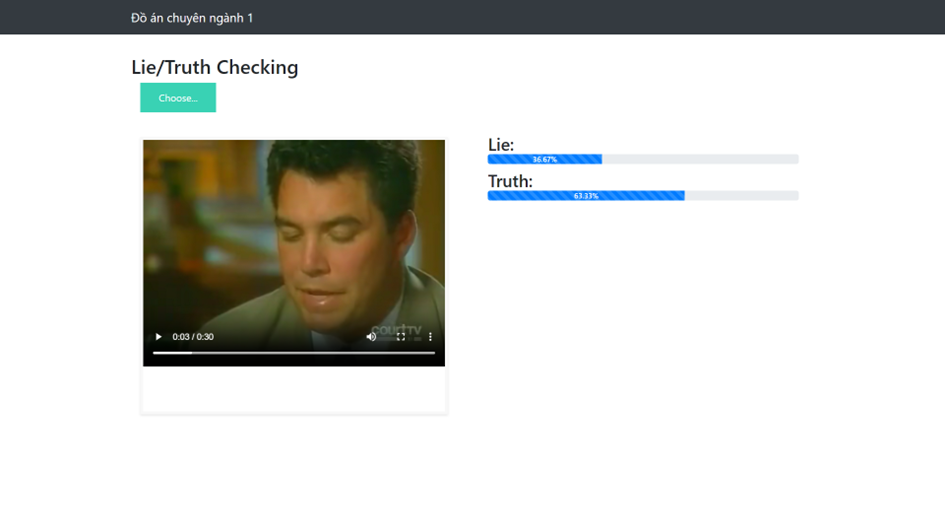

# Truth Or Lie

## Introduction
Truth Or Lie is a web-based application that analyzes a video of a person speaking and determines the percentage of truthfulness or deception using a pre-trained machine learning model.



## Features
- Upload and analyze videos
- Uses AI to detect truthfulness
- Displays percentage results of truth and lies
- User-friendly web interface

## Technologies Used
- **Backend**: Python (Flask)
- **Machine Learning**: Jupyter Notebook, OpenCV
- **Frontend**: HTML, CSS, JavaScript
- **Database**: SQLite/PostgreSQL

## Installation Guide
1. **Clone the repository**
   ```sh
   git clone https://github.com/HoangDat47/truthOrLie.git
   cd truthOrLie
   ```
2. **Set up a virtual environment** (optional but recommended)
   ```sh
   python -m venv venv
   source venv/bin/activate  # On macOS/Linux
   venv\Scripts\activate     # On Windows
   ```
3. **Install dependencies**
   ```sh
   pip install -r requirements.txt
   ```
4. **Run the application**
   ```sh
   python app.py
   ```

## Project Structure
```
truthOrLie/
├── library/         # Supporting libraries or modules
├── model/           # ML models for lie detection
├── static/          # Static files (images, CSS, JS)
├── templates/       # HTML templates for UI
│   ├── text.jpg     # Illustration image
├── video/           # Video resources
├── app.py           # Main application file
├── final_train.ipynb # ML training notebook
├── lieDetect.py     # Lie detection functions
├── requirements.txt # Required Python dependencies
└── README.md        # Project documentation
```

## Contributing
Feel free to contribute by submitting a pull request or reporting issues on GitHub.

## License
This project is licensed under the MIT License. See the `LICENSE` file for details.

---
If you have any questions, feel free to open an issue on GitHub!

